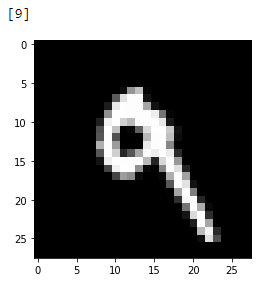

# CNN-on-MNIST-dataset

### Dataset
In this project, I have used Keras MNIST dataset of handwritten digits, [Here](https://keras.io/datasets/#mnist-database-of-handwritten-digits). In this Dataset, there are 60,000 train images each 28x28 grayscale images of the 10 digits, along with 10,000 train images.

### Dependencies 
- Python 3.7 or 3.6
- Keras Library , [Here](https://pypi.org/project/Keras/)

### Description
The aim is to predit the y-labels, here y-labels is image of handwritten digits, representing as integer value from 0-9. In other words, 
there are 10 classes(0-9) and we have to predict the correct class.
I also saved the model as "mymodel.h5" , so that you can use it for your project.

### Approach
Indeed, I used three Convolutional Layers, Maxpooling2D layer, Flatten layer, Dropout for preventing overfitting of the model, and Dense layers for classification. Here, I used 'relu' activation in conv2d and 'softmax' activation in Dense.

1. Convolutional layer with 32 feature maps of size 3×3.
2. Convolutional layer with 64 feature maps of size 3×3.
3. MaxPooling layer taking the max over 2*2 patches.
4. Convolutional layer with 16 feature maps of size 3×3.
5. Flatten layer.
6. Dropout layer with a probability of 0.20 or 20%.
7. Output layer with 'softmax' activation..

### Model
In keras model (mymodel.h5), I have used adam optimizers, categorical_crossentropy loss to achieve classification accuracy of 98.89% . 
the model is fit over 10 epochs with a batch size of 32.

### prediction

In above image, actual value is in the image and predicted value is class [9] 
